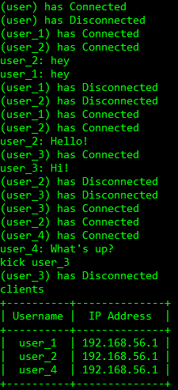
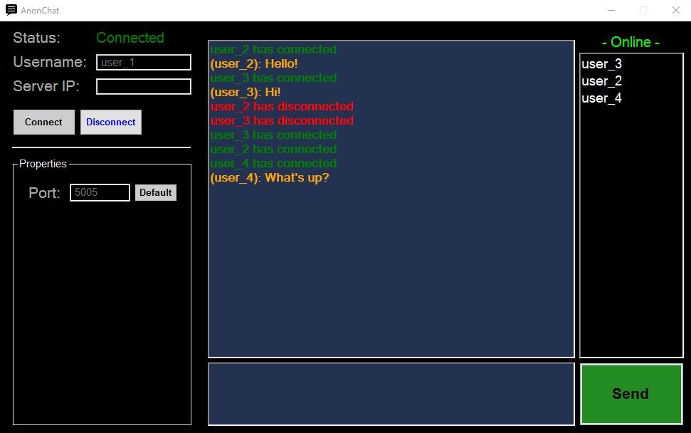

# Server
- Must be running to allow clients to connect and communicate
- Ability to display, message and kick connected users
- No limit to how many clients can connect

# Client
- Must be binded to the Server IP Address
- Ability to send to and receive messages from both server and other users

